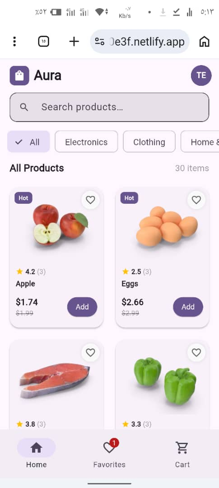
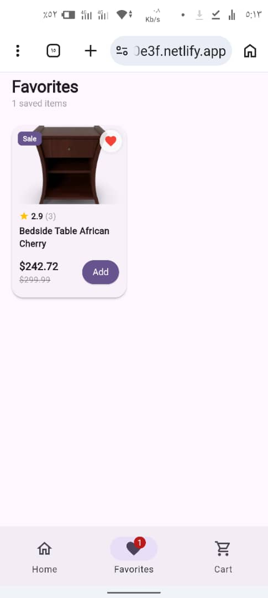
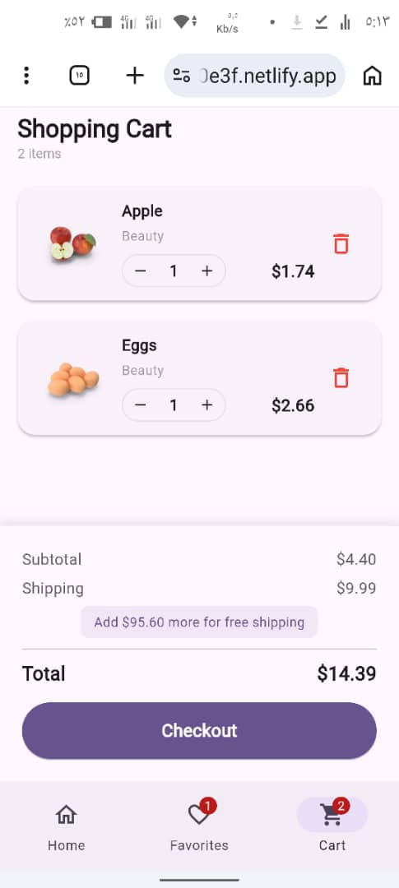

# تقرير مشروع: تطبيق Aura للتجارة الإلكترونية

**المادة:** تطوير تطبيقات الجوال  
**إطار العمل:** Flutter  
**قاعدة البيانات:** Supabase (PostgreSQL)

| البيان | القيمة |
|--------|--------|
| **اسم الطالب** | عبدالرحمن عبدالخالق احمد عقلان |
| **رابط GitHub** | ___________________________ |
| **رابط الويب** | https://steady-dango-520e3f.netlify.app/ |
| **البريد الإلكتروني المستخدم** | teamworkprofour@gmail.com |
| **كلمة المرور** | Za123456789z |

---

# 1. نبذة عن المشروع

**Aura** هو تطبيق جوال للتجارة الإلكترونية مبني باستخدام Flutter ويعتمد على Supabase كمزود للمصادقة وقاعدة البيانات السحابية. يتيح التطبيق للمستخدمين إنشاء حساب، تسجيل الدخول، تصفح المنتجات، البحث عنها، إضافتها إلى المفضلة، وإدارة سلة التسوق.

---

# 2. التقنيات المستخدمة

| التقنية | الإصدار | الغرض |
|---------|---------|-------|
| Flutter | 3.x | إطار تطوير واجهة المستخدم |
| Dart | 3.x | لغة البرمجة |
| Supabase | 2.x | المصادقة وقاعدة البيانات |
| Provider | 6.x | إدارة الحالة |
| Cached Network Image | 3.x | تحميل الصور |
| Shimmer | 3.x | تأثير التحميل |
| HTTP | 1.x | جلب البيانات من API |

---

# 3. التمارين المطلوبة وطريقة التنفيذ

---

## التمرين الأول — المصادقة (Authentication)

### المتطلب

تنفيذ نظام تسجيل الدخول وإنشاء حساب باستخدام البريد الإلكتروني وكلمة المرور.

### الملفات ذات الصلة

- `lib/screens/auth/auth_screen.dart`
- `lib/providers/auth_provider.dart`

### الكود المُنفذ

```dart
Future<String?> signIn(String email, String password) async {
  try {
    await _client.auth.signInWithPassword(
      email: email,
      password: password,
    );
    return null;
  } on AuthException catch (e) {
    return e.message;
  }
}

Future<String?> signUp(String email, String password) async {
  try {
    await _client.auth.signUp(
      email: email,
      password: password,
    );
    return null;
  } on AuthException catch (e) {
    return e.message;
  }
}
```

### الشرح

يعتمد التطبيق على Supabase Authentication لإدارة جلسات المستخدم. عند نجاح تسجيل الدخول يتم الانتقال إلى الشاشة الرئيسية، بينما يتم عرض شاشة تسجيل الدخول في حالة عدم وجود جلسة نشطة.

### لقطات الشاشة

#### شاشة تسجيل الدخول


---

#### شاشة إنشاء الحساب


---

#### بعد تسجيل الدخول



---

## التمرين الثاني — قراءة البيانات من Supabase

### المتطلب

تخزين المنتجات داخل جدول **products** وقراءتها وعرضها داخل التطبيق.

### الملفات ذات الصلة

- `lib/providers/store_provider.dart`
- `lib/screens/home/home_screen.dart`
- `lib/widgets/product_card.dart`

### جدول قاعدة البيانات

```sql
CREATE TABLE products (
  id             INTEGER PRIMARY KEY,
  name           TEXT NOT NULL,
  price          DECIMAL(10,2) NOT NULL,
  original_price DECIMAL(10,2),
  category       TEXT NOT NULL,
  rating         DECIMAL(3,1) DEFAULT 4.0,
  review_count   INTEGER DEFAULT 10,
  image          TEXT,
  badge          TEXT,
  in_stock       BOOLEAN DEFAULT TRUE,
  description    TEXT,
  created_at     TIMESTAMPTZ DEFAULT NOW()
);
```

### الكود المُنفذ

```dart
Future<void> loadProducts() async {

  final rows = await _client.from('products').select();

  if (rows.isNotEmpty) {
    _products = rows.map((r) => Product.fromRow(r)).toList();
    notifyListeners();
    return;
  }

  final res = await http.get(Uri.parse(_dummyApi));
  final items = _parseDummyJson(res.body);

  await _client
      .from('products')
      .insert(items.map((e) => e.toRow()).toList());

  _products = items;
}
```

### الشرح

يقوم التطبيق أولاً بقراءة المنتجات من قاعدة بيانات Supabase، وإذا لم تكن البيانات موجودة فإنه يجلبها من API خارجي ثم يحفظها في قاعدة البيانات.

### لقطات الشاشة

#### الصفحة الرئيسية


---

#### شاشة المنتجات


---

## التمرين الثالث — المفضلة الخاصة بكل مستخدم

### المتطلب

تخزين المفضلة لكل مستخدم باستخدام معرف المستخدم (user_id).

### الملفات ذات الصلة

- `lib/providers/store_provider.dart`
- `lib/screens/favorites/favorites_screen.dart`

### جدول قاعدة البيانات

```sql
CREATE TABLE favorites (
  id BIGSERIAL PRIMARY KEY,
  user_id UUID REFERENCES auth.users(id) ON DELETE CASCADE NOT NULL,
  product_id INTEGER NOT NULL,
  product_data JSONB NOT NULL,
  created_at TIMESTAMPTZ DEFAULT NOW(),
  UNIQUE(user_id, product_id)
);
```

### الكود المُنفذ

```dart
Future<void> loadFavorites() async {

  final uid = _client.auth.currentUser?.id;

  final rows = await _client
      .from('favorites')
      .select('product_data')
      .eq('user_id', uid!);

  _favorites = rows
      .map((e) => Product.fromJson(e['product_data']))
      .toList();
}

Future<void> toggleFavorite(Product product) async {

  final uid = _client.auth.currentUser?.id;

  if (!isFavorite(product.id)) {

    await _client.from('favorites').upsert({
      'user_id': uid,
      'product_id': product.id,
      'product_data': product.toJson(),
    });

  } else {

    await _client
        .from('favorites')
        .delete()
        .eq('user_id', uid!)
        .eq('product_id', product.id);

  }
}
```

### الشرح

تُحفظ قائمة المفضلة في جدول مستقل داخل Supabase، ويتم ربط كل عنصر بالمستخدم الحالي، مما يضمن أن كل مستخدم يرى مفضلاته فقط.

### لقطات الشاشة

#### شاشة المفضلة



---

# 4. هيكل ملفات المشروع

```text
flutter_ecommerce/

pubspec.yaml

lib/

main.dart

models/
└── product.dart

providers/
├── auth_provider.dart
└── store_provider.dart

screens/
├── auth/
├── home/
├── favorites/
└── cart/

widgets/
├── product_card.dart
└── skeleton_card.dart
```

---

# 5. نظرة عامة على الشاشات

## الصفحة الرئيسية


---

## شاشة المفضلة


---

## شاشة السلة



---

## شاشة تسجيل الدخول


---

## شاشة إنشاء الحساب


---

## شاشة الدفع


---

# 6. إعداد المشروع وتشغيله

## المتطلبات

- Flutter SDK 3.0 أو أحدث
- Dart SDK 3.0 أو أحدث
- Android Studio أو VS Code
- حساب Supabase

## خطوات التشغيل

```bash
flutter pub get
flutter run
```

## إعداد Supabase

1. إنشاء مشروع جديد في Supabase.
2. تفعيل Email Authentication.
3. إنشاء الجداول باستخدام أوامر SQL.
4. إضافة Project URL وAnon Key داخل المشروع.

---

# 7. الميزات المنفذة

- تسجيل الدخول باستخدام البريد الإلكتروني.
- إنشاء حساب جديد.
- تسجيل الخروج.
- قراءة المنتجات من Supabase.
- إضافة المنتجات إلى المفضلة.
- حفظ المفضلة لكل مستخدم.
- سلة تسوق.
- البحث في المنتجات.
- تصفية المنتجات حسب الفئة.
- تأثير Shimmer أثناء التحميل.
- تصميم متجاوب.

---

تم تطوير هذا المشروع كجزء من متطلبات مقرر تطوير تطبيقات الجوال.